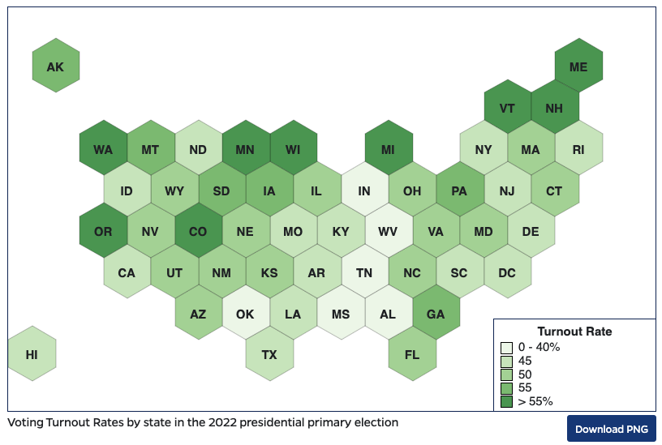

# WPShortcode-hexmap

A Wordpress shortcode to join a CSV & GeoJSON to make a choropleth map.

The name and demo use a hex map to give each state equal area and visibility. However, despite the name and demo, it can be used with other GeoJSON files and proper geometries, not just hex maps.


## Quick Start

1. Upload the files to your theme.

2. Include the `hexmaps/functions-hexmaps.php` file in your theme's `functions.php` file.

```
require_once 'hexmaps/functions-hexmaps.php';
```

3. Use a shortcode like this, supplying a CSV file and a GeoJSON file, the fields that map between the CSV and GeoJSON files, what GeoJSON attribute gives the name for each place, and what CSV field is used to classify and color the choropleth map.

```
[hexmap geofile="/data/us_states_hexgrid.geojson" csvfile="/data/2022_General_Turnout_Rates.csv" csvlinkfield="state_abv" geolinkfield="state_abv" geonamefield="StateName" csvdatafield="Turnout Rate"]
```




## Shortcode Options

* `geofile` = Required. URL of the GeoJSON file.
* `csvfile` = Required. URL of the CSV file.
* `csvlinkfield` = Required. The column name in the CSV which uniquely identifies a feature, and matches to a feature in the GeoJSON via the `geolinkfield` attribute.
* `geolinkfield` = Required. The attribute name in the GeoJSON file which uniquely identifies a feature, and matches to a feature in the CSV via the `geolinkfield` attribute.
* `csvvaluefield` = Required. The CSV column name which supplies the values used to color the map.
* `breaks` = A comma-joined list of numbers, forming the breaks used to categorize each feature and to pick a color.
  * Example: `breaks="20,40,60,80"` would create 5 classes: less than or equal to 20, less than or equal to 40, less than or equal to 60, less than or equal to 80, and greater than 80.
  * The special value "auto" may be used instead of a list of breaks, in which case breaks will be automatically calculated to form five equal-interval classes (quintiles).
* `colors` = A comma-joined list of colors to be assigned to those classes.
  * Colors may be #RRGGBB codes or well-known browser color names.
  * There should always be 1 more color than there are values in `breaks`
  * Example: `colors="#f7f7f7,#cccccc,red,green,#purple"`
  * If omitted, five shades of grey will be assigned to correspond to 4 breaks / 5 classes.
* `geonamefield` = Required. The attribute name in the GeoJSON which is the place's name. This will be shown in tooltips and popups.
* `geolabelfield` = Optional, attribute name in the GeoJSON which is the place's label to display on the map.
  * This only works with very short labels and relatively large areas, e.g. two-letter state/province codes.
* `prefix` = String, will be prepended to the value in popup & tooltip. Useful to turn the value into something more friendly, or to describe it.
  * Example: `prefix="Approx."`
* `suffix` = String, will be appended to the value in popup & tooltip. Useful to turn the value into something more friendly, or to describe it.
  * Example: `prefix="tonnes of ice cream"`
* `legendtitle` = A title for the legend which is automatically generated.
  * May be left blank, and no legend will be generated.
* `legendlocation` = Where to place the legend. Must be one of: `lowerright`, `lowerleft`
  * Defaults to `lowerright`
* `caption` = An optional caption to be placed below the map. This is linked to the map's `aria-describedby` for accessibility purposes.
* `width` = A width for the generated map, in CSS format.
  * Example: `width="800px"`
* `downloadbuttoncssclass` = CSS classes to apply to the Download PNG button, to fit into your site's other buttons and style.
  * Default is `btn btn-sm btn-primary` which fits Bootstrap 4 and 5
  * If you specify blank `downloadbuttoncssclass=""` then the button will not be displayed.
